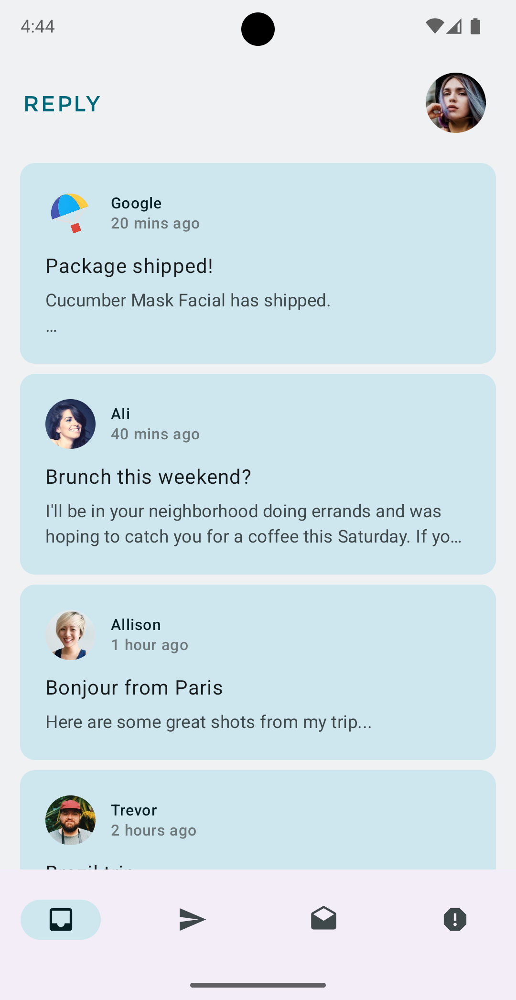
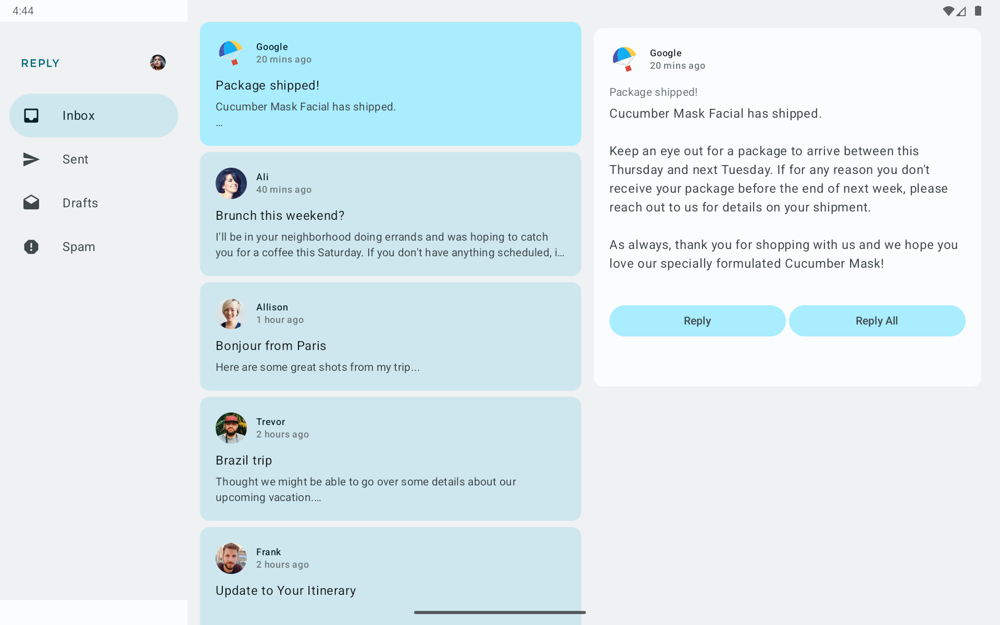
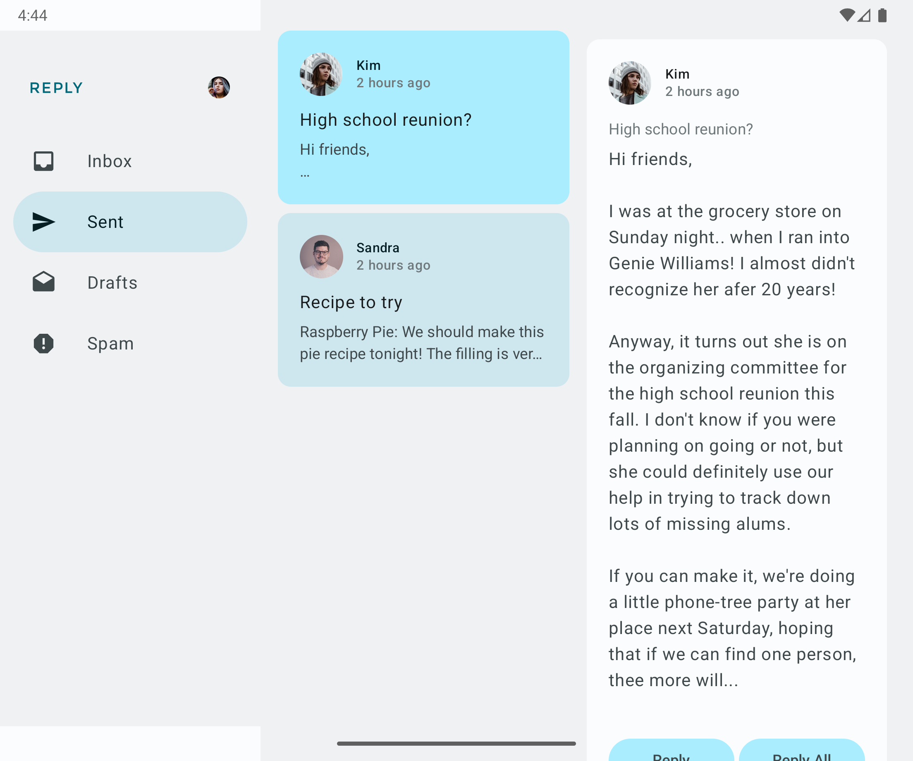

# Reply App

> A basic email-like client built with Jetpack Compose—demonstrates adaptive layouts, Material 3 theming, and elegant navigation across varying screen sizes.

##  Features

- **Adaptive UI Layouts**  
  Responsive design using `WindowSizeClass` to adapt between phone, tablet, and foldable screens.
- **Multiple Navigation Patterns**  
  Compact layouts use bottom navigation, while expanded screens switch to navigation rail or side drawer.
- **Material 3 Theming**  
  Implements M3 theming, including primary-container and on-primary-container for emphasized UI states  [oai_citation:0‡GitHub](https://github.com/google-developer-training/basic-android-kotlin-compose-training-reply-app?utm_source=chatgpt.com) [oai_citation:1‡Android Developers](https://developer.android.com/develop/ui/compose/designsystems/material3?utm_source=chatgpt.com) [oai_citation:2‡Android Developers](https://developer.android.com/codelabs/basic-android-kotlin-compose-adaptive-content-for-large-screens?utm_source=chatgpt.com) [oai_citation:3‡Google Codelabs](https://codelabs.developers.google.com/jetpack-compose-adaptability?utm_source=chatgpt.com).
- **Clean, Compose-Only Implementation**  
  Built entirely with Jetpack Compose — no fragments or XML needed.

##  Screenshots

|                  Tablet                   |               Foldable Phone               |
|:-----------------------------------------:|:------------------------------------------:|
|  |  |

##  Prerequisites

- Android Studio Arctic Fox or newer
- Minimum Android SDK API level 21
- Kotlin and Jetpack Compose setup enabled